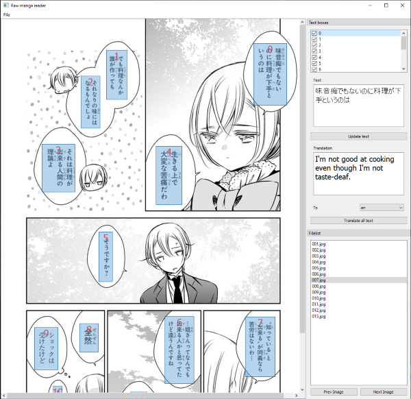

# Raw manga reader

Raw manga reader is a python application for detecting text in a japanese manga and automatically translate them. The application is implemented with machine learning,
OCR software and machine translation service. For more information on how this work see [How it works](#How-it-works).


## Setup

You will need to install [tesseract](https://github.com/tesseract-ocr/tesseract) on your machine
and make sure that tesseract command is accessible by adding the installed directory to the path.
You must be able to invoke *tesseract* command

detectron2 is pre-built for windows 10 and CUDA 10.2. The whl file for this prebuilt package is under detectron2_win_cuda10.2 directory.
You will need to have [CUDA toolkit 10.2](https://developer.nvidia.com/cuda-10.2-download-archive) installed and have a supported graphic card.

This command below will installed all the dependency including prebuilt detectron2.

```
pip install cython
pip install numpy==1.18.4
pip install -r requirements.txt
```

For other platform or setup, you will need to compile your own detectron2 or get pre-built detectron2 for linux from [here](https://github.com/facebookresearch/detectron2/blob/master/INSTALL.md).

### Getting Microsoft translator API subscription key

The program requires Microsoft translator API subscription key to run. You can sign up for free. It is free for under 2M char translated per month.
Make sure that the location is **Global** when you create a service.

https://docs.microsoft.com/en-us/azure/cognitive-services/translator/translator-how-to-signup

### Download model pretrain weight

Download the [model pretrain weight](https://www.dropbox.com/s/irpswfkx9bgsmlt/model_final.pth) and put it under rawmangareader\model directory.

## Dependencies

The project depends on
- python 3.7
- [detectron2](https://github.com/facebookresearch/detectron2)
- [pytorch](https://pytorch.org) 1.5
- [pytesseract](https://github.com/madmaze/pytesseract)
- opencv
- pyQt5

All the dependencies should already be installed then you install requirements.txt

## Running the program

`python -m rawmangareader`

Once the program starts, you will need to open **File > Setting** to setup translator API subscription key.

Next you can do **File > Open** to open a directory containing images.

## Usage

* User can check or uncheck the text box to show or hide it from the image.
* The text detected sometime will be wrong due to furigana or just because the OCR software was not trained for manga text.
* User can modify the original text if the what the program detects is incorrect or contains weird character. Then you can click **Translate all text** button to do a translation again.
* The quality of the translation depends on the translation service. Note that machine translation does not have enough context about the text that it translates.



## Known limitation

* The program only works with Japanese text right now.
* Does not work if the directory path contains unicode character (non english language).
* No image resize to fit screen.
* Changing between image is a slow due to the program running ML algorithm to predict where the speech box will be and translated all the text.

## How it works

I trained ML model using detectron2 to be able to detect basic manga speech box. Then I feed the output to OCR.
For this project I use [pytesseract](https://github.com/madmaze/pytesseract), which is an open source OCR tool for python based on [tesseract](https://github.com/tesseract-ocr/tesseract). After I got the text from OCR output, I use [Microsoft translator API](https://docs.microsoft.com/en-us/azure/cognitive-services/translator/translator-how-to-signup) to translate the text.

## Contributing

Send a pull request.

## License

This project is licensed under the MIT License - see the [LICENSE](LICENSE) file for details.
